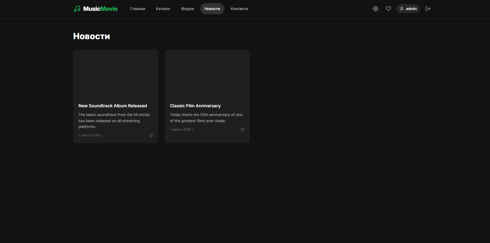
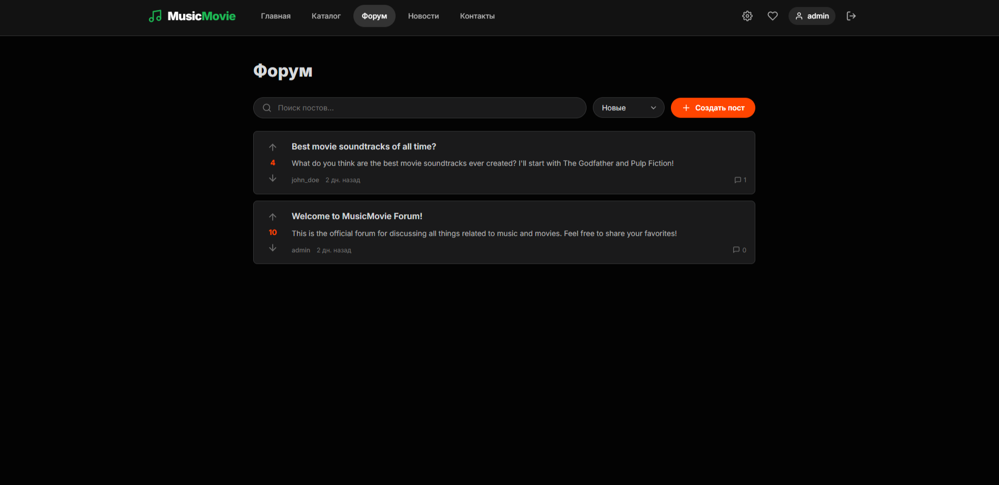

# MusicMovie

[](https://www.python.org/)
[](https://fastapi.tiangolo.com/)
[](https://www.sqlite.org/)
[](https://www.sqlalchemy.org/)
[](https://docs.pydantic.dev/)
[](https://pytest.org/)
[](https://nodejs.org/)
[](https://react.dev/)
[](https://vitejs.dev/)

A full-stack web platform that combines music and movies into a seamless entertainment experience.

---

## 📸 Project Showcase

### Main Interface


### Dashboard & Statistics


### Browse Movies


### Browse Music


### User Features




### Community




### Admin Panel


### Authentication


---

## 🚀 Quick Start

### Backend Setup

```bash
# Navigate to backend
cd backend

# Create virtual environment
python -m venv .venv

# Activate virtual environment
# Windows:
.venv\Scripts\activate
# macOS/Linux:
source .venv/bin/activate

# Install dependencies
pip install -r requirements.txt

# Initialize database
alembic upgrade head

# (Optional) Seed database
python seed.py

# Run backend server
uvicorn app.main:app --reload --host 0.0.0.0 --port 8000
```

### Frontend Setup

```bash
# Navigate to frontend
cd frontend

# Install dependencies
npm install

# Run development server
npm run dev
```

### DOCKER BUILD
```bash
docker-compose up --build
```

### Access the Application

- **Frontend:** http://localhost:3000
- **Backend API:** http://localhost:8000
- **API Docs:** http://localhost:8000/docs

---

## 📋 Prerequisites

- **Python 3.11.4+** - [Download](https://www.python.org/downloads/)
- **Node.js 20+** - [Download](https://nodejs.org/)
- **Git** - [Download](https://git-scm.com/)

---

## 🧪 Testing

### Backend Tests
```bash
cd backend
pytest
```

### Frontend Tests
```bash
cd frontend
npm test
```
